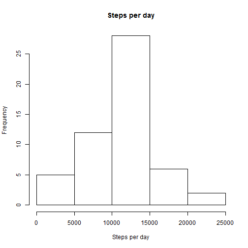
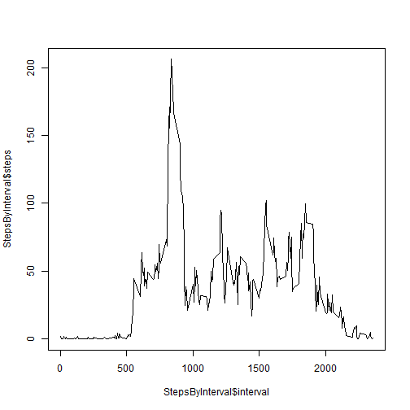
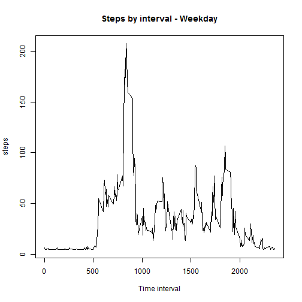
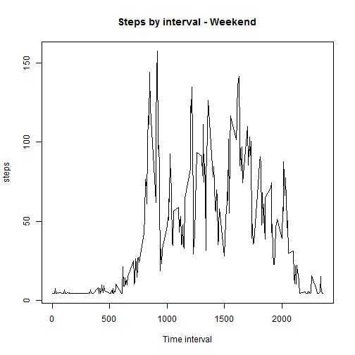

# Reproducible Research: Peer Assessment 1


## Loading and preprocessing the data
For this analysis, very little preprocessing is done.  The forked repository contains a zipped folder called "activity".  The files within this folder were extracted to a folder called "activity".  Following this, the coding should run properly.


```r
dataset <- read.csv("activity/activity.csv")
```


## What is mean total number of steps taken per day?

The histogram for total steps taken each day can be created as follows:

```r
StepsByDay <- aggregate(steps ~ date, data = dataset, FUN = sum)

hist(StepsByDay$steps, main = "Steps per day", xlab = "Steps per day", ylab = "Frequency")
```

 


The mean and median number of steps taken each day are calculated as follows:

```r
StepsPerDayMean <- mean(StepsByDay$steps)
StepsPerDayMedian <- median(StepsByDay$steps)
StepsPerDayMean
```

```
## [1] 10766
```

```r
StepsPerDayMedian
```

```
## [1] 10765
```


## What is the average daily activity pattern?

The following plot shows the average steps taken in each time interval, averaged over all days

```r
StepsByInterval <- aggregate(steps ~ interval, data = dataset, FUN = mean)

plot(StepsByInterval$interval, StepsByInterval$steps, type = "l")
```

 


On average, the time interval containing the most steps can be calculated as follows:

```r
MaxInterval <- StepsByInterval$interval[tail(order(StepsByInterval$steps), 1)]
MaxInterval
```

```
## [1] 835
```


## Imputing missing values

The total number of missing values is calculated as follows:

```r
NumberMissing <- sum(is.na(dataset$steps))
NumberMissing
```

```
## [1] 2304
```


These missing values were all filled in with 34 steps for the full interval.


```r
dataset_filled <- dataset

num <- length(dataset_filled$steps)

for (i in 1:num) {
    if (is.na(dataset_filled$steps[i])) {
        dataset_filled$steps[i] <- 34
    }
}
```


Following this filling in of the missing data, another histogram is generated as follows:


```r
StepsByDay_filled <- aggregate(steps ~ date, data = dataset_filled, FUN = sum)

hist(StepsByDay_filled$steps, main = "Summary of steps per day", xlab = "Steps per Day", 
    ylab = "Frequency")
```

 


The mean and median number of steps taken each day based on the filled in dataset are again calculated as follows:


```r
StepsPerDayMean_filled <- mean(StepsByDay_filled$steps)
StepsPerDayMedian_filled <- median(StepsByDay_filled$steps)
StepsPerDayMean_filled
```

```
## [1] 10638
```

```r
StepsPerDayMedian_filled
```

```
## [1] 10395
```

This imputing of data caused small decreases in both the mean and median measurements of steps per day.  These changes are <5%.

## Are there differences in activity patterns between weekdays and weekends?
To analyze the differences between activity levels on the weekend vs during the week, background calculation must be done to generate a vector of factors (weekday vs weekend).  This is done as seen below:


```r
weekdays <- weekdays(as.POSIXlt(dataset$date), abbreviate = TRUE)

is.weekday <- vector(length = num, mode = "character")

for (j in 1:num) {
    if (weekdays[j] == "Sun" | weekdays[j] == "Sat") {
        is.weekday[j] <- "weekend"
    } else {
        is.weekday[j] <- "weekday"
    }
}
is.weekday <- as.factor(is.weekday)
```


The average steps per interval were again calculated after separating the full dataset into a data set for each day type.


```r
dataset_day_type <- cbind(dataset_filled, is.weekday)
dataset_weekday <- dataset_day_type[dataset_day_type$is.weekday == "weekday", 
    ]
dataset_weekend <- dataset_day_type[dataset_day_type$is.weekday == "weekend", 
    ]

weekday_steps <- aggregate(steps ~ interval, data = dataset_weekday, FUN = mean)
weekend_steps <- aggregate(steps ~ interval, data = dataset_weekend, FUN = mean)
```

The following plots demonstrate the differences between step levels during the day when broken down by weekday type.


```r
plot(weekday_steps$interval, weekday_steps$steps, type = "l", xlab = "Time interval", 
    ylab = "steps", main = "Steps by interval - Weekday")
```

 

```r

plot(weekend_steps$interval, weekend_steps$steps, type = "l", xlab = "Time interval", 
    ylab = "steps", main = "Steps by interval - Weekend")
```

 


These plot show significantly increased afternoon activity on the weekends when compared to the weekdays.
